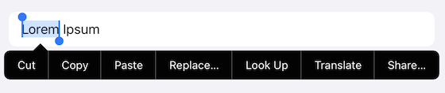
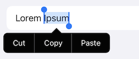

# Use `canPerformAction` for TextField/Editor in SwiftUI

You know how a `TextField` displays a set of context menu?



It doesn't matter if it's UIKit or SwiftUI, and if it's a `TextField` (which uses `UITextField`) or `TextEditor` (which uses `UITextView`).

Now say I don't want to see all of those things, but (in my case) only `cut/copy/paste`.



## Back in the days, in UIKit

All you had to do was to do

```
class MyUITextField: UITextField {
    override func textFieldCanPerformAction(_ action: Selector, withSender sender: Any?) -> Bool {
        action == #selector(UIResponderStandardEditActions.copy(_:))
        || action == #selector(UIResponderStandardEditActions.cut(_:))
        || action == #selector(UIResponderStandardEditActions.paste(_:))
    }
}
```

Then, in my Code (or even for those crazy Storyboarders out there in my Storyboard) I'd use a `MyUITextField` instance instead of the default `UITextField`.

## SwiftUI? UIViewRepresentable? Are you crazy...

Now, sure, my first tought was... Okay...

```
struct MyTextField: UIViewRepresentable {
(...)
    func makeUIView(context: Context) -> MyUITextField {
        // configure and return...
    }
(...)
}
```

But as you might imagine, it means you have to basically REIMPLEMENT the whole `UITextField` stuff! Not to mention, how do you translate `Font` to `UIFont`, and all kind of crazy things (e.g. specifying a frame, etc, ...)

Believe me, I did that, it wasn't nice to read by any means. [Yurk](https://www.youtube.com/watch?v=BZ-Vvl9_WiU).


## Swizzling to the rescue!

So I was thinking, all it takes is a little bit of Swizzling. Look at [App.swift](App.swift) now!

If you comment `private let responder = Responder()`, your `Replace..., Look Up, Translate, Share...` will be back! 😁

# ⚠️ WARNING

The fact that e.g. a SwiftUI `TextField` is implemented with a `UITextField` is obviously an *implementation detail*.

If Apple ever changes that (e.g. a `Text` isn't a `UILabel`), the trick won't work anymore, obviously.